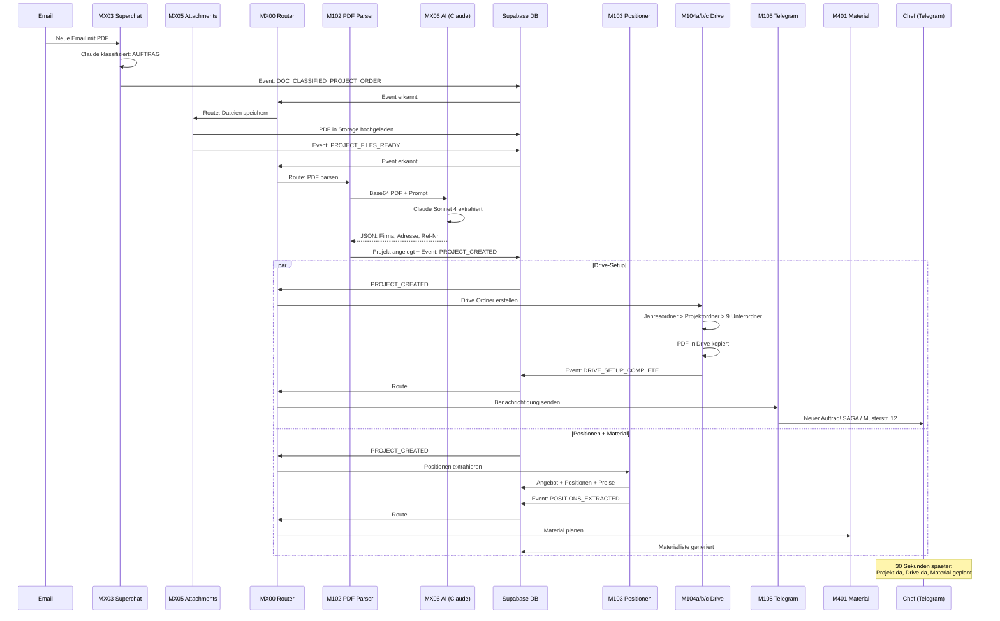
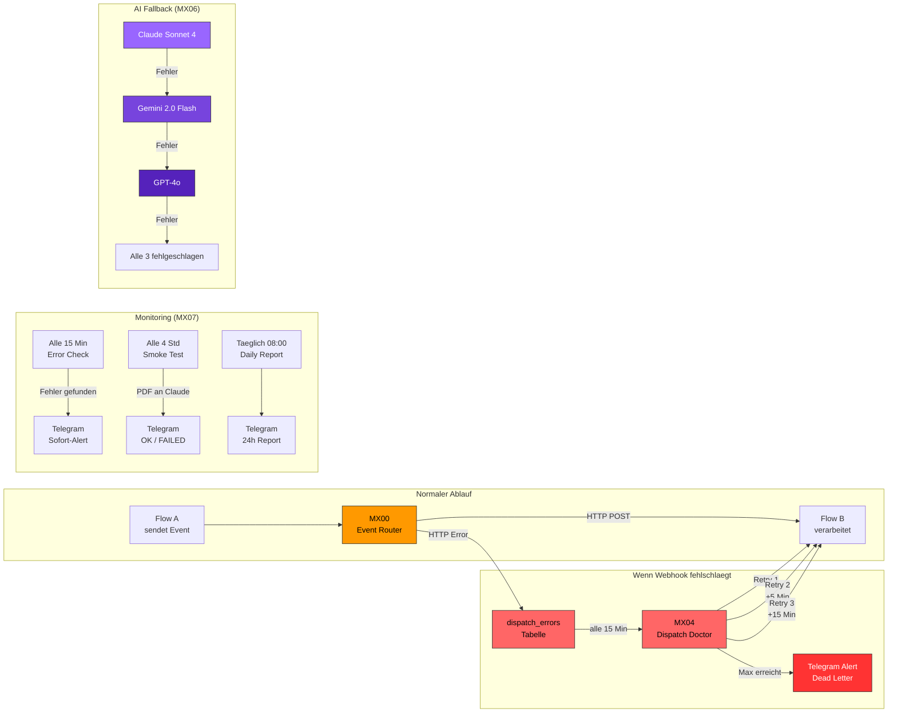
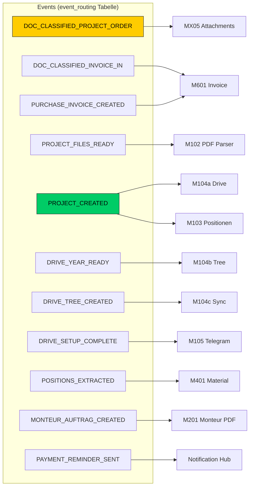

# BauGenius Flow-Architektur

## 1. Gesamtübersicht (Wer ruft wen?)

```mermaid
graph TB
    subgraph TRIGGER["TRIGGER"]
        EMAIL["Email eingang"]
        RECEIPT["Beleg in Drive"]
        MAGICPLAN["MagicPlan Export"]
        MANUAL["Manuell / UI"]
        CRON["Zeitgesteuert"]
    end

    subgraph INFRA["INFRASTRUKTUR"]
        MX00["MX00 Event Router<br/>Zentrale Weiche"]
        MX04["MX04 Dispatch Doctor<br/>Retry alle 15 Min"]
        MX01["MX01 Error Handler<br/>Fehler abfangen"]
        MX07["MX07 Flow Monitor<br/>24h Health Check"]
        MX06["MX06 AI Fallback<br/>Claude > Gemini > GPT"]
    end

    subgraph M1["M1: INTAKE (Der Flash)"]
        MX03["MX03 Superchat Intake<br/>Klassifizierung"]
        MX05["MX05 Attachment Processor<br/>Dateien speichern"]
        M102["M102 PDF Parser<br/>Daten extrahieren"]
        M103["M103 Position Extractor<br/>Positionen + Preise"]
        M104a["M104a Prepare Drive<br/>Jahresordner"]
        M104b["M104b Create Project Tree<br/>9 Unterordner"]
        M104c["M104c Sync Files<br/>PDF hochladen"]
        M105["M105 Notification<br/>Telegram an Chef"]
    end

    subgraph M2["M2: BAUSTELLE"]
        M201["M201 Monteur-Auftrag PDF"]
        M202["M202 Sync ZB Progress"]
        M203["M203 Protokoll PDF"]
        M210["M210 Sub-Order Generator"]
    end

    subgraph M4["M4: MATERIAL"]
        M401["M401 Material Planner"]
        M401a["M401a Receipt Intake<br/>Drive Watch"]
        M401b["M401b Receipt Processor<br/>Beleg scannen"]
        M410["M410 MagicPlan Parser"]
    end

    subgraph M6["M6: FINANZEN"]
        M601["M601 Invoice Processor"]
    end

    %% Trigger-Verbindungen
    EMAIL --> MX03
    RECEIPT --> M401a
    MAGICPLAN --> M410
    CRON --> MX04
    CRON --> MX07

    %% Intake Chain
    MX03 -->|DOC_CLASSIFIED| MX00
    MX00 -->|PROJECT_ORDER| MX05
    MX00 -->|INVOICE_IN| M601
    MX05 -->|FILES_READY| MX00
    MX00 --> M102
    M102 -->|ruft auf| MX06
    MX06 -.->|Claude/Gemini/GPT| M102
    M102 -->|PROJECT_CREATED| MX00

    %% Drive Chain
    MX00 --> M104a
    M104a -->|DRIVE_YEAR_READY| MX00
    MX00 --> M104b
    M104b -->|DRIVE_TREE_CREATED| MX00
    MX00 --> M104c
    M104c -->|DRIVE_SETUP_COMPLETE| MX00
    MX00 --> M105

    %% Position + Material Chain
    M102 -->|PROJECT_CREATED| MX00
    MX00 --> M103
    M103 -->|POSITIONS_EXTRACTED| MX00
    MX00 --> M401

    %% Receipt Chain
    M401a --> M401b
    M401b -->|PURCHASE_INVOICE_CREATED| MX00
    MX00 --> M601

    %% Error Handling
    MX00 -.->|Fehler| MX04
    MX04 -.->|Retry| MX00
    MX01 -.->|Alle Flows| MX01

    %% Styling
    style MX00 fill:#ff9900,stroke:#333,color:#000
    style MX06 fill:#9966ff,stroke:#333,color:#fff
    style MX04 fill:#ff6666,stroke:#333,color:#000
    style MX07 fill:#66aaff,stroke:#333,color:#000
    style M102 fill:#00cc66,stroke:#333,color:#000
    style M105 fill:#00cc66,stroke:#333,color:#000
    style EMAIL fill:#ffcc00,stroke:#333,color:#000
```

---

## 2. Der Flash: Email bis Freigabe (Schritt für Schritt)

---

## 3. Fehlerbehandlung & Monitoring

---

## 4. Flow-Tabelle (Alle 21 Flows)

| Flow | Trigger | Macht was | Ruft auf | Sendet Event |
|------|---------|-----------|----------|--------------|
| **MX00 Event Router** | Webhook + Sweeper (5 Min) | Zentrale Weiche: Event > Routing > Webhook | Alle Flows via HTTP | - |
| **MX01 Error Handler** | n8n Error Trigger | Fehler loggen + Telegram | Telegram | - |
| **MX02 Folder Manager** | Webhook | Drive-Ordner finden/erstellen | Google Drive | - |
| **MX03 Superchat Intake** | Superchat Webhook | Email klassifizieren (Claude) | Claude, Superchat | DOC_CLASSIFIED_* |
| **MX04 Dispatch Doctor** | Schedule (15 Min) | Fehlgeschlagene Events erneut senden | Ziel-Webhooks | - |
| **MX05 Attachment Processor** | Webhook | Dateien von Superchat in Storage | Supabase Storage | PROJECT_FILES_READY |
| **MX06 AI Fallback** | Webhook | Claude > Gemini > GPT Fallback | Claude, Gemini, GPT | - |
| **MX07 Flow Monitor** | Schedule (15 Min/4h/Daily) | Health Checks + Smoke Test | n8n API, Telegram | - |
| **M101 Email Trigger** | Gmail Poll (5 Min) | Neue Emails erkennen | Gmail | - |
| **M102 PDF Parser** | Webhook | PDF mit Claude extrahieren | MX06 | PROJECT_CREATED |
| **M103 Position Extractor** | Webhook | Positionen + Preise zuordnen | Supabase | POSITIONS_EXTRACTED |
| **M104a Prepare Drive** | Webhook | Jahresordner in Drive | Google Drive | DRIVE_YEAR_READY |
| **M104b Create Tree** | Webhook | 9 Projektunterordner | Google Drive | DRIVE_TREE_CREATED |
| **M104c Sync Files** | Webhook | PDF in Drive kopieren | Google Drive, Storage | DRIVE_SETUP_COMPLETE |
| **M105 Notification** | Webhook | Telegram an Chef | Telegram | NOTIFICATION_SENT |
| **M201 Monteur-Auftrag** | Webhook | Arbeitsauftrag-PDF | Gotenberg | - |
| **M202 Sync ZB** | Webhook | Baufortschritt abgleichen | Supabase | ZB_PROGRESS_SYNCED |
| **M203 Protokoll PDF** | Webhook | Begehungsprotokoll-PDF | Gotenberg | - |
| **M401 Material Planner** | Webhook | Materialliste aus Positionen | Supabase | MATERIALS_PLANNED |
| **M401b Receipt Processor** | Schedule (30 Sek) | Belege scannen mit Claude | Claude, Drive | PURCHASE_INVOICE_CREATED |
| **M601 Invoice Processor** | Webhook | Eingangsrechnungen verarbeiten | Claude, Drive | - |

---

## 5. Event-Routing Karte

