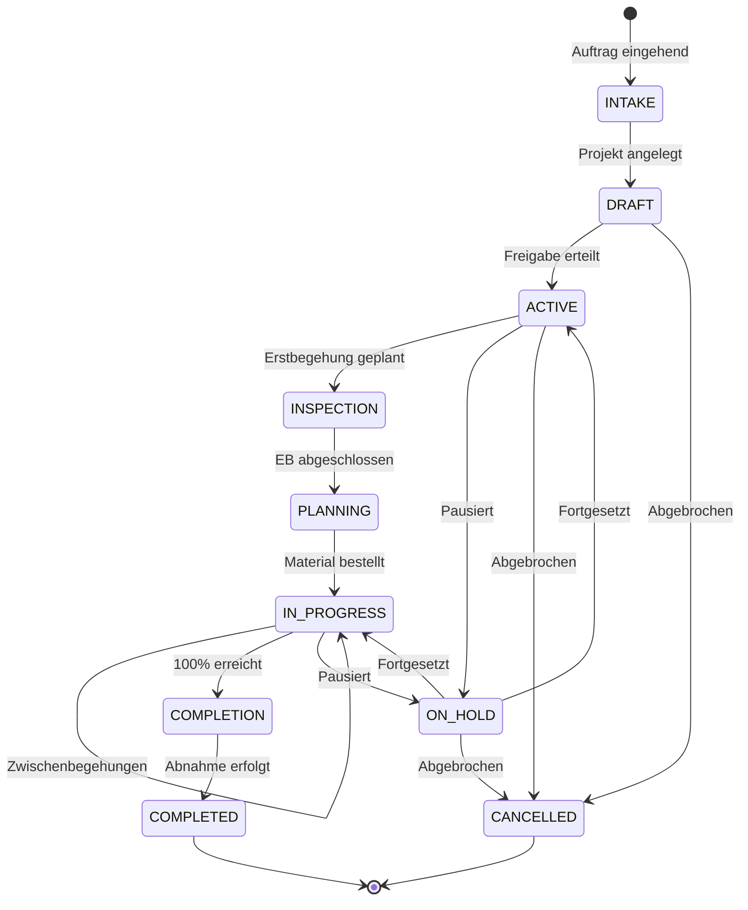

# Baugenius Workflow-Ãœbersicht

> **Stand:** 21.12.2024  
> **Status:** Definiert, DB-ready, n8n-Flows in Planung

---

## Gesamtübersicht

```mermaid
flowchart TB
    subgraph INTAKE["📥 PHASE 1: Auftragseingang"]
        A1[📧 Mail/WhatsApp] --> A2[n8n: Polling]
        A2 --> A3[🤖 Claude: Extraktion]
        A3 --> A4[(Supabase: Project anlegen)]
        A4 --> A5[📁 Drive: Ordner erstellen]
        A5 --> A6[📱 Telegram: Notification]
    end

    subgraph EB["🔍 PHASE 2: Erstbegehung"]
        B1[📐 Magic Plan: Scan] --> B2[📧 Email Export]
        B2 --> B3[n8n: Gmail Polling]
        B3 --> B4[🤖 Claude: Adress-Match]
        B4 --> B5[📱 Telegram: HITL Frage]
        B5 --> B6{Dennis: Bestätigung}
        B6 -->|Ja| B7[📁 Drive: Aufmaß ablegen]
        B6 -->|Korrektur| B4
        B7 --> B8[📝 Tally: EB-Protokoll]
        B8 --> B9[n8n: Webhook]
        B9 --> B10[(Supabase: Protocol speichern)]
        B10 --> B11[Status: INSPECTION ✓]
    end

    subgraph MATERIAL["📦 PHASE 3: Material & Planung"]
        C1[n8n: Aufmaß + Auftrag laden] --> C2[🤖 Claude: Materialvorschlag]
        C2 --> C3[📱 Telegram: Vorschlag]
        C3 --> C4{Dennis: Freigabe}
        C4 -->|Ändern| C2
        C4 -->|OK| C5[📧 Gmail: Draft erstellen]
        C5 --> C6[📱 Telegram: Final Freigabe]
        C6 --> C7[📧 Email an Händler]
        C7 --> C8[(Supabase: Bestellung speichern)]
        C8 --> C9[Status: PLANNING ✓]
    end

    subgraph SUB["👷 PHASE 4: Sub-Auftrag"]
        D1[n8n: Positionen laden] --> D2[DB: Türkische Texte]
        D2 --> D3[📄 PDF generieren DE+TR]
        D3 --> D4[📁 Drive: Monteur_Sub]
        D4 --> D5[📱 Telegram: Fertig]
        D5 --> D6[Dennis: Weiterleiten]
    end

    subgraph BAU["🏗️ PHASE 5: Bauablauf"]
        E1[⏰ n8n: Wöchentlicher Trigger] --> E2[📱 Telegram: ZB Reminder]
        E2 --> E3[📝 Tally: ZB-Protokoll]
        E3 --> E4[n8n: Webhook]
        E4 --> E5[(Supabase: Progress update)]
        E5 --> E6[📁 Drive: Fotos ablegen]
        E6 --> E7[Status: IN_PROGRESS]
        E7 -->|< 100%| E1
        E7 -->|= 100%| F1
    end

    subgraph DONE["✅ PHASE 6: Abnahme"]
        F1[📝 Tally: Abnahme-Protokoll] --> F2[n8n: Webhook]
        F2 --> F3[(Supabase: Abnahme speichern)]
        F3 --> F4[📁 Drive: Endfotos]
        F4 --> F5[Status: COMPLETED ✓]
        F5 --> F6[📱 Telegram: Projekt fertig!]
    end

    INTAKE --> EB
    EB --> MATERIAL
    MATERIAL --> SUB
    SUB --> BAU
    BAU --> DONE
```

---

## Datenfluss

```mermaid
flowchart LR
    subgraph INPUTS["📥 Inputs"]
        I1[📧 Gmail]
        I2[📱 WhatsApp]
        I3[📐 Magic Plan]
        I4[📝 Tally Forms]
    end

    subgraph N8N["⚙️ n8n Orchestration"]
        N1[Scheduler]
        N2[Webhooks]
        N3[AI Processing]
        N4[File Handling]
    end

    subgraph STORAGE["💾 Storage"]
        S1[(Supabase)]
        S2[📁 Google Drive]
    end

    subgraph OUTPUTS["📤 Outputs"]
        O1[📱 Telegram]
        O2[📧 Email Drafts]
        O3[📄 PDFs]
    end

    I1 --> N2
    I2 --> N2
    I3 --> N2
    I4 --> N2
    
    N1 --> N3
    N2 --> N3
    N3 --> N4
    
    N4 --> S1
    N4 --> S2
    
    N3 --> O1
    N4 --> O2
    N4 --> O3
```

---

## Projekt-Status Flow

---

## HITL / Approval Flow

```mermaid
flowchart TB
    subgraph REQUEST["📨 Anfrage"]
        R1[n8n: create_approval] --> R2[(approvals: PENDING)]
        R2 --> R3[📱 Telegram: Freigabe-Anfrage]
    end

    subgraph DECISION["⚖️ Entscheidung"]
        R3 --> D1{Dennis}
        D1 -->|Freigeben| D2[Kategorie: OK]
        D1 -->|Anpassen| D3[Kategorie: *_WRONG]
        D1 -->|Ablehnen| D4[Kategorie: REJECT/*]
    end

    subgraph PROCESS["⚙️ Verarbeitung"]
        D2 --> P1[decide_approval: APPROVED]
        D3 --> P2[decide_approval: APPROVED + Feedback]
        D4 --> P3[decide_approval: REJECTED]
        
        P1 --> E1[Event: APPROVAL_DECIDED]
        P2 --> E1
        P3 --> E1
    end

    subgraph FOLLOWUP["➡️ Folgeaktion"]
        E1 --> F1{Status?}
        F1 -->|APPROVED| F2[n8n: Nächster Schritt]
        F1 -->|REJECTED| F3[n8n: Abbruch/Revision]
    end
```

---

## Drive Ordnerstruktur

```mermaid
flowchart TB
    ROOT[📁 10_PROJEKTE] --> P1[📁 BL-2025-001_Musterstr_3]
    
    P1 --> F1[📁 01_Auftragsunterlagen]
    P1 --> F2[📁 02_Aufmass]
    P1 --> F3[📁 03_Erstbegehung]
    P1 --> F4[📁 04_Material]
    P1 --> F5[📁 05_Baufortschritt]
    P1 --> F6[📁 06_Nachtraege]
    P1 --> F7[📁 07_Abnahme]
    P1 --> F8[📁 08_Rechnung]
    P1 --> F9[📁 09_Monteur_Sub]

    F1 --> D1[📄 Original_Auftrag.pdf]
    F2 --> D2[📄 MagicPlan_Export.pdf]
    F3 --> D3[📄 EB_Protokoll_001.pdf]
    F3 --> D4[🖼️ Fotos...]
    F5 --> D5[📄 ZB_Protokoll_001.pdf]
    F5 --> D6[📄 ZB_Protokoll_002.pdf]
    F7 --> D7[📄 Abnahme_Protokoll.pdf]
    F9 --> D8[📄 Sub_Auftrag_DE.pdf]
    F9 --> D9[📄 Sub_Auftrag_TR.pdf]
```

---

## Tally Formulare

| Formular | Felder | Webhook → |
|----------|--------|-----------|
| **EB-Protokoll** | Projekt (Dropdown), Datum, Zustand (Checkboxen), Mängel, Fotos, Notizen | `protocols` (ERSTBEGEHUNG) |
| **ZB-Protokoll** | Projekt, Datum, Fortschritt %, Probleme, Fotos, Nächste Schritte | `protocols` (ZWISCHENBEGEHUNG) |
| **Material-Protokoll** | Projekt, Material-Liste, Mengen, Dringlichkeit, Fotos | `protocols` (MATERIAL) |
| **Abnahme-Protokoll** | Projekt, Datum, Mängel (Checkboxen), Restarbeiten, Fotos, Unterschrift | `protocols` (ABNAHME) |

---

## Ablauf-Tabelle

| Phase | Trigger | Agent-Aktion | HITL | Output |
|-------|---------|--------------|------|--------|
| **1. Intake** | Mail/WhatsApp | Extraktion, Project anlegen | Projekt bestätigen | Project in DB, Drive-Ordner |
| **2. EB** | Magic Plan Export | Adress-Match | Projekt zuordnen | Aufmaß in Drive, EB-Protokoll |
| **3. Material** | EB abgeschlossen | Materialvorschlag | Freigabe | Bestellung an Händler |
| **4. Sub** | Material bestätigt | PDF generieren (DE+TR) | - | Sub-Auftrag in Drive |
| **5. Bau** | Wöchentlich | ZB-Reminder | ZB ausfüllen | Progress-Update |
| **6. Abnahme** | 100% erreicht | Abnahme-Reminder | Abnahme ausfüllen | Projekt COMPLETED |

---

*Dokumentation erstellt: 21.12.2024*
